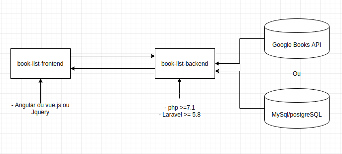

```

      ___           ___           ___                         ___     
     /  /\         /  /\         /  /\          ___          /  /\    
    /  /::|       /  /::\       /  /:/         /__/\        /  /::\   
   /  /:|:|      /  /:/\:\     /  /:/          \  \:\      /__/:/\:\  
  /  /:/|:|__   /  /:/  \:\   /  /:/            \__\:\    _\_ \:\ \:\ 
 /__/:/_|::::\ /__/:/ \__\:\ /__/:/     /\      /  /::\  /__/\ \:\ \:\
 \__\/  /~~/:/ \  \:\ /  /:/ \  \:\    /:/     /  /:/\:\ \  \:\ \:\_\/
       /  /:/   \  \:\  /:/   \  \:\  /:/     /  /:/__\/  \  \:\_\:\  
      /  /:/     \  \:\/:/     \  \:\/:/     /__/:/        \  \:\/:/  
     /__/:/       \  \::/       \  \::/      \__\/          \  \::/   
     \__\/         \__\/         \__\/                       \__\/    

```

# Listagem de Livros

- Faça um fork deste repositorio, assim que finalizar o desafio realize o pull request.

Requisitos:

- PHP >= 7.1
- Laravel
- Bootstrap >= 4
- Vue.js || Angular 7+ || Jquery


#### Descrição

- Buscar livros pelo título, autor ou ISBN;
- Listar livros (título, ISBN, autor, editora, ano);
- Apresentar quantidades de registros encontrados;
- Paginação;
- Filtrar livros por périodo (ano);
- Detalhes do livro

### Dica

- Para a listagem de livros pode ser utilizada a Google Books API ([Aqui](https://developers.google.com/books))


### Arquitetura



